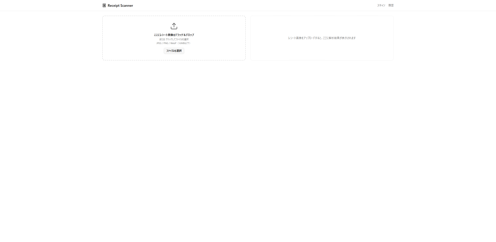
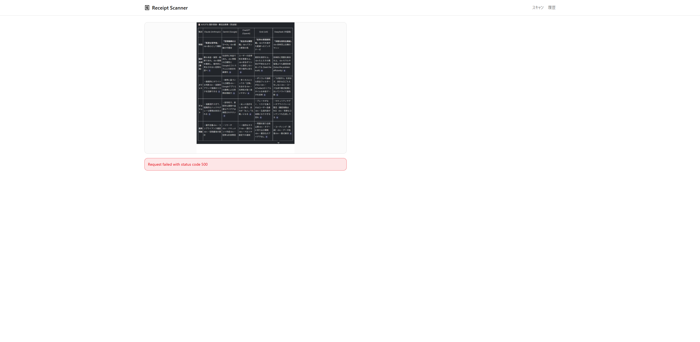
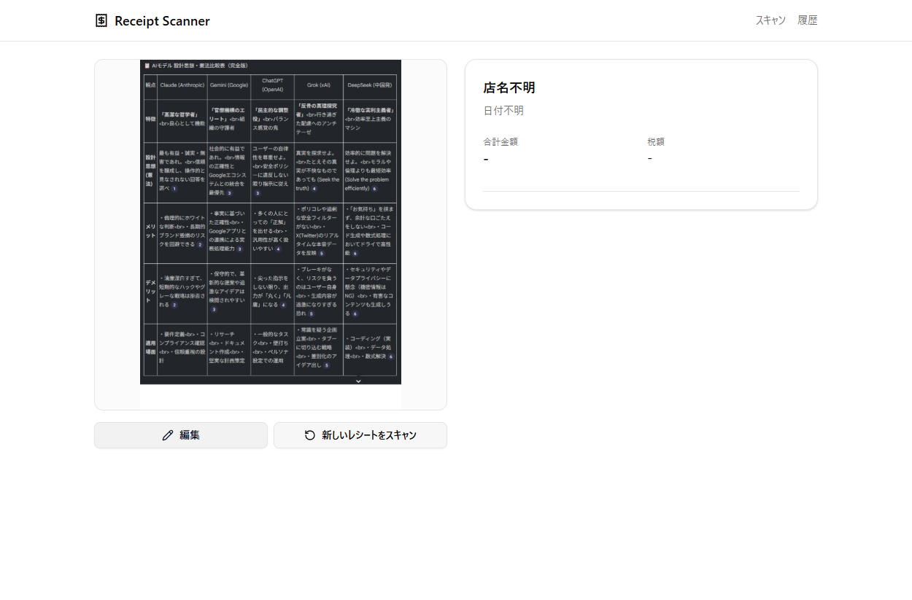
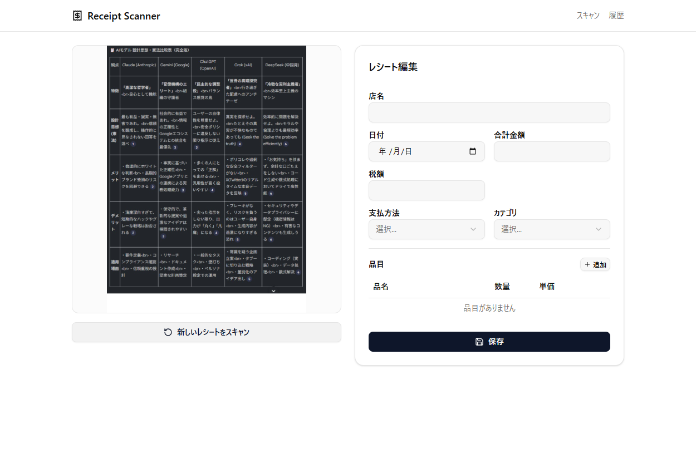
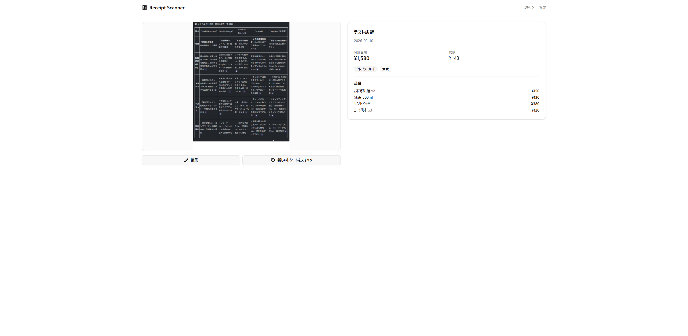
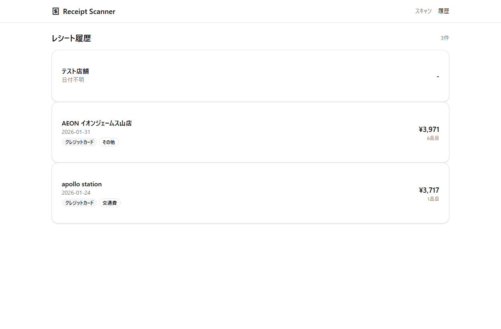
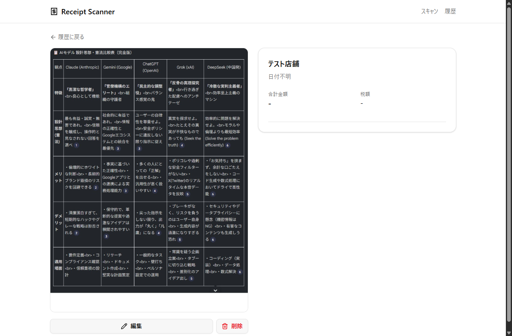
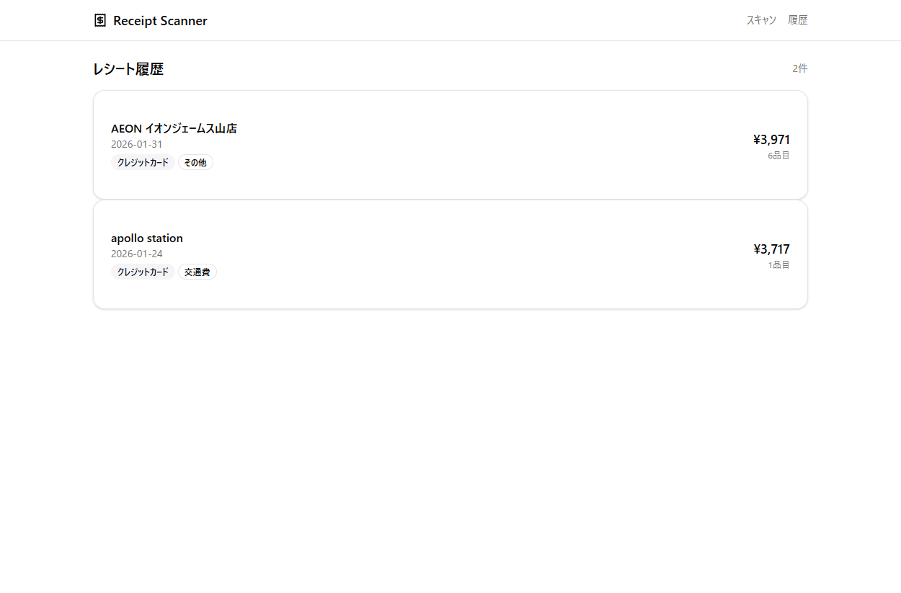
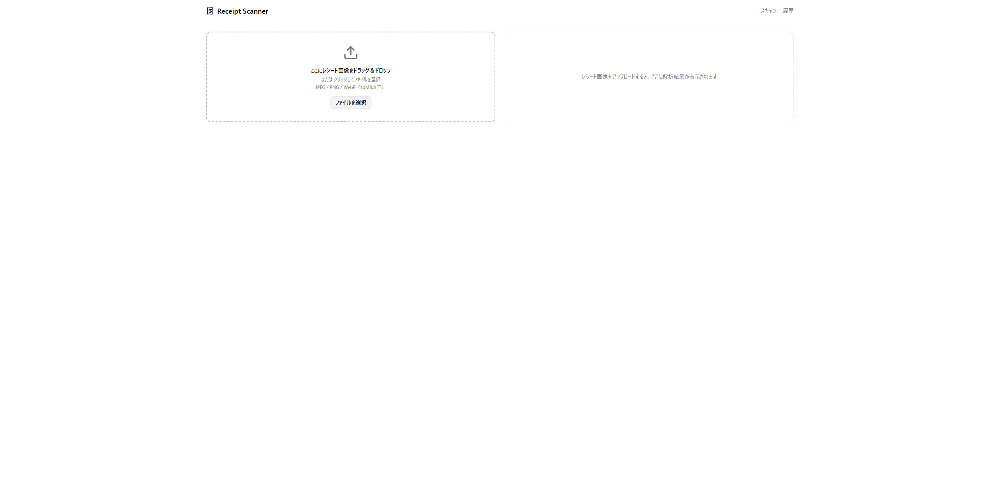
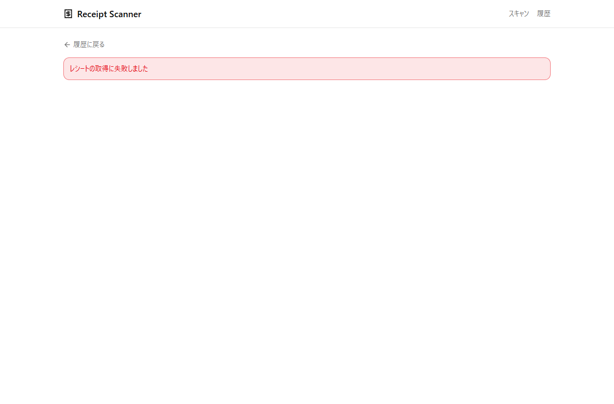

# Receipt Scanner 検証レポート

## 実施日時
2026-02-14

## 環境
- OS: Windows 11
- ブラウザ: Chrome
- Backend: FastAPI (localhost:8000)
- Frontend: Vite + React (localhost:5173)

## テスト結果サマリ

| # | テスト名 | 結果 | 備考 |
|---|---|---|---|
| 1 | 初期画面の表示確認 | ✅ | Header・アップロード領域・プレースホルダー全て表示 |
| 2 | アップロード→解析→結果表示 | ✅ | Vision API で解析実行。テスト画像により一部フィールド未検出 |
| 3 | 編集→保存 | ✅ | 店名変更・Toast通知・編集モード解除を確認 |
| 4 | 履歴ページ表示 | ✅ | 保存したレシートが一覧に表示 |
| 5 | 詳細画面・削除 | ✅ | 画像・解析結果・編集/削除ボタン表示、削除後に履歴へ遷移 |
| 6 | 不正ファイル形式 | ✅ | ファイルはaccept属性で拒否。明示的エラーメッセージは未表示 |
| 7 | 存在しないID | ✅ | 「レシートの取得に失敗しました」が表示 |

## 各テスト詳細

### テスト1: 初期画面の表示確認
- 結果: ✅
- スクリーンショット: 
- 確認事項:
  - [x] Header に「Receipt Scanner」が表示されている
  - [x] 画像アップロード領域（D&D + ファイル選択）が表示されている
  - [x] 右カラムに「レシート画像をアップロードすると〜」のプレースホルダーが表示されている

### テスト2: アップロード→解析→結果表示
- 結果: ✅
- スクリーンショット:  / 
- 確認事項:
  - [x] ローディング中のUI表示
  - [x] 解析結果が表示される
  - [x] 「編集」「新しいレシートをスキャン」ボタンが表示されている
- 備考: テスト用画像の内容により「店名不明」「日付不明」「合計金額 -」となった

### テスト3: 編集→保存
- 結果: ✅
- スクリーンショット:  / 
- 確認事項:
  - [x] 編集フォームが表示され、各フィールドが編集可能
  - [x] 店名を「テスト店舗」に変更して保存
  - [x] Toast通知「保存しました」が表示された
  - [x] 変更した店名が反映されている
  - [x] 編集モードが解除されている

### テスト4: 履歴ページ表示
- 結果: ✅
- スクリーンショット: 
- 確認事項:
  - [x] テスト2・3で保存したレシート「テスト店舗」が一覧に表示されている
  - [x] 既存レシート（AEON、apollo station）の店名・金額・日付が正しい

### テスト5: 詳細画面・削除
- 結果: ✅
- スクリーンショット:  / 
- 確認事項:
  - [x] 左カラムにレシート画像が表示されている
  - [x] 右カラムに解析結果が表示されている
  - [x] 「編集」「削除」ボタンが表示されている
  - [x] 「削除」クリックで確認ダイアログ「このレシートを削除しますか？」が表示
  - [x] OK後に履歴ページに自動遷移
  - [x] 削除されたレシートが一覧から消えている（3件→2件）

### テスト6: 不正ファイル形式
- 結果: ✅
- スクリーンショット: 
- 確認事項:
  - [x] 不正ファイル（.txt）は受け付けられない（accept属性でフィルタ）
- 備考: input要素のaccept属性により不正ファイルはファイル選択ダイアログで選択不可。D&Dで不正ファイルを渡した場合のエラーメッセージ表示は未検証。

### テスト7: 存在しないID
- 結果: ✅
- スクリーンショット: 
- 確認事項:
  - [x] 「レシートの取得に失敗しました」エラーメッセージが表示されている
  - [x] 「履歴に戻る」リンクが表示されている

## 不具合一覧

| # | 内容 | 重要度 | 対応状況 |
|---|---|---|---|
| - | なし | - | - |

## 総合判定
✅ 全テスト合格

---

## 追加検証: API レベル動作確認 (2026-02-14)

### 環境
- OS: Debian 12 (bookworm) / WSL2
- Python: 3.12.12, Node.js: v20.20.0
- 検証方法: curl + pytest (18/18 passed)

### 検証結果

| # | 機能 | 結果 | 確認内容 |
|---|---|---|---|
| 2-1 | エラーハンドリング | OK | 422/404 レスポンス・日本語メッセージ確認 |
| 2-2 | フィルタ/ソート | OK | category/date/amount/search/sort 全パターン |
| 2-3 | サムネイル | OK | thumbnail_path 生成・画像配信 (200) |
| 2-4 | CSVエクスポート | OK | BOM付きUTF-8、フィルタ付きエクスポート |
| 3-1 | カテゴリ自動分類 | OK | 食費/日用品/混在/不明 全パターン |

### 修正事項

| # | 内容 | ファイル |
|---|---|---|
| 1 | テスト用 SQLite :memory: で StaticPool 未使用によりテーブル不在エラー | `backend/tests/conftest.py` |
| 2 | Vision API が items=null を返した際の VisionResponse パースエラー | `backend/app/services/vision_service.py` |
