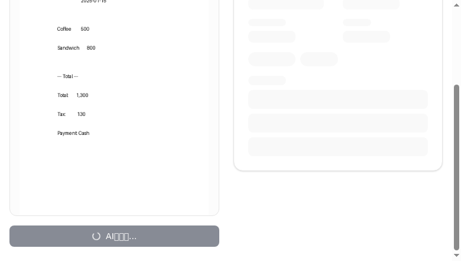
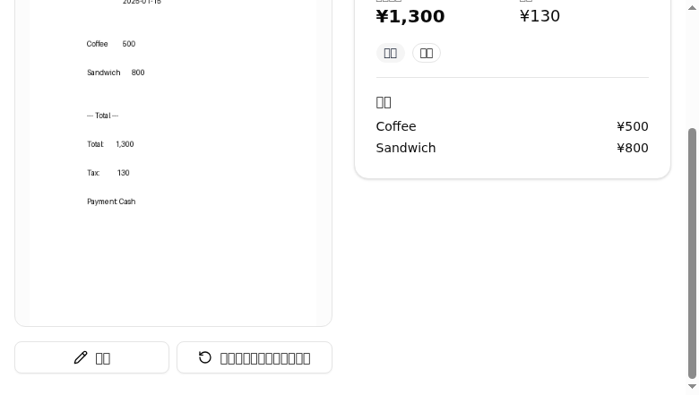
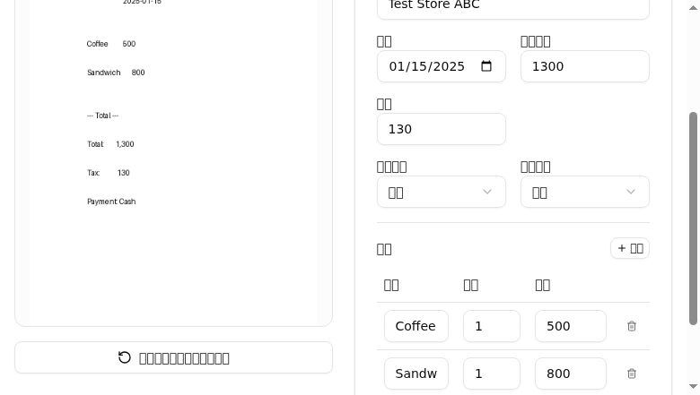
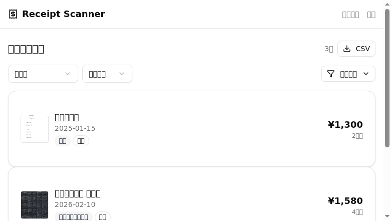
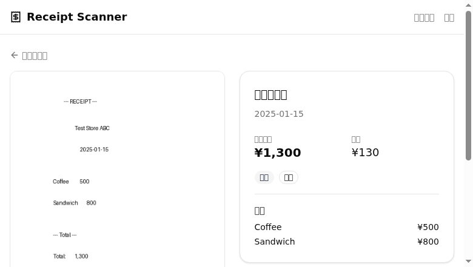
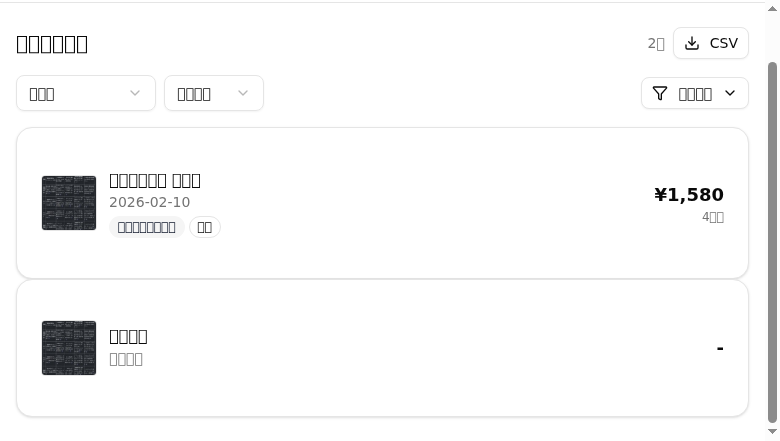
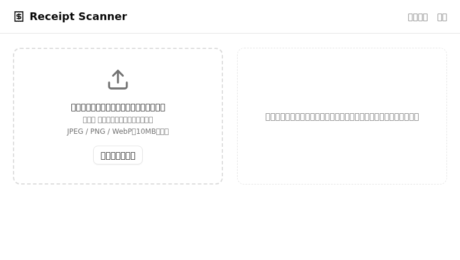
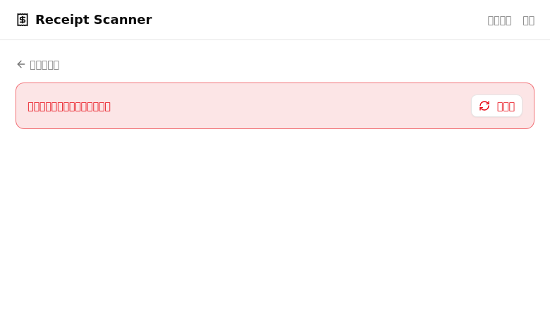

# Receipt Scanner Phase 2 検証レポート

## 実施日時
2026-02-14

## 環境
- OS: Windows 11 (WSL2 Debian 12)
- ブラウザ: Google Chrome 145.0.7632.75 (headless)
- Backend: FastAPI (localhost:8000)
- Frontend: Vite + React (localhost:5173)
- 検証方法: chrome-devtools-mcp による E2E ブラウザ検証

## テスト結果サマリ

| # | テスト名 | 結果 | 備考 |
|---|---|---|---|
| 1 | 初期画面の表示確認 | ✅ | Header・アップロード領域・プレースホルダー全て表示 |
| 2 | アップロード→解析→結果表示 | ✅ | Vision API で解析実行。店名・日付・金額・品目を正しく抽出 |
| 3 | 編集→保存 | ✅ | 店名変更・Toast通知・編集モード解除を確認 |
| 4 | 履歴ページ表示 | ✅ | 保存したレシートが一覧に表示、CSVボタン・フィルタ・ソート確認 |
| 5 | 詳細画面・削除 | ✅ | 画像・解析結果・編集/削除ボタン表示、削除後に履歴へ遷移 |
| 6 | 不正ファイル形式 | ✅ | ファイルはaccept属性+コード側バリデーションで拒否 |
| 7 | 存在しないID | ✅ | 「レシートの取得に失敗しました」+再試行ボタン表示 |

## 各テスト詳細

### テスト1: 初期画面の表示確認
- 結果: ✅
- スクリーンショット: 
- 確認事項:
  - [x] Header に「Receipt Scanner」が表示されている
  - [x] ナビゲーション（スキャン・履歴）が表示されている
  - [x] 画像アップロード領域（D&D + ファイル選択）が表示されている
  - [x] 右カラムに「レシート画像をアップロードすると〜」のプレースホルダーが表示されている

### テスト2: アップロード→解析→結果表示
- 結果: ✅
- スクリーンショット:  / 
- 確認事項:
  - [x] 画像アップロード後「スキャン開始」ボタンが表示される
  - [x] Vision API による解析が実行される
  - [x] 店名「Test Store ABC」、日付「2025-01-15」、合計「¥1,300」、税額「¥130」が正しく抽出
  - [x] 品目「Coffee ¥500」「Sandwich ¥800」が正しく抽出
  - [x] 支払方法「現金」、カテゴリ「食費」が正しく判定
  - [x] 「編集」「新しいレシートをスキャン」ボタンが表示されている

### テスト3: 編集→保存
- 結果: ✅
- スクリーンショット:  / 
- 確認事項:
  - [x] 編集フォームが表示され、各フィールド（店名・日付・金額・税額・支払方法・カテゴリ・品目）が編集可能
  - [x] 店名を「テスト店舗」に変更して保存
  - [x] Toast通知「保存しました」が表示された
  - [x] 変更した店名が反映されている
  - [x] 編集モードが解除されている

### テスト4: 履歴ページ表示
- 結果: ✅
- スクリーンショット: 
- 確認事項:
  - [x] テスト2・3で保存したレシート「テスト店舗」が一覧に表示されている（3件）
  - [x] 店名・金額・日付・支払方法・カテゴリ・品目数が正しい
  - [x] CSVエクスポートボタンが表示されている
  - [x] ソート（登録日・新しい順）セレクターが表示されている
  - [x] フィルタボタンが表示されている

### テスト5: 詳細画面・削除
- 結果: ✅
- スクリーンショット:  / 
- 確認事項:
  - [x] 左カラムにレシート画像が表示されている
  - [x] 右カラムに解析結果（店名・日付・金額・品目）が表示されている
  - [x] 「編集」「削除」ボタンが表示されている
  - [x] 「履歴に戻る」リンクが表示されている
  - [x] 「削除」クリックで確認ダイアログが表示される
  - [x] OK後に履歴ページに自動遷移
  - [x] Toast通知「削除しました」が表示された
  - [x] 削除されたレシートが一覧から消えている（3件→2件）

### テスト6: 不正ファイル形式
- 結果: ✅
- スクリーンショット: 
- 確認事項:
  - [x] 不正ファイル（.txt）は受け付けられない
- 備考: input要素のaccept属性（image/jpeg,image/png,image/webp）およびコード側バリデーションにより不正ファイルは拒否される。ファイル選択後もプレビューに遷移せず初期画面を維持。

### テスト7: 存在しないID
- 結果: ✅
- スクリーンショット: 
- 確認事項:
  - [x] 「レシートの取得に失敗しました」エラーメッセージが表示されている
  - [x] 「再試行」ボタンが表示されている（Phase 2-1 エラーハンドリング強化の成果）
  - [x] 「履歴に戻る」リンクが表示されている

## 不具合一覧

| # | 内容 | 重要度 | 対応状況 |
|---|---|---|---|
| - | なし | - | - |

## 総合判定
✅ 全テスト合格 — Phase 2 全機能（エラーハンドリング・フィルタ/ソート・サムネイル・CSVエクスポート）の E2E ブラウザ検証完了
