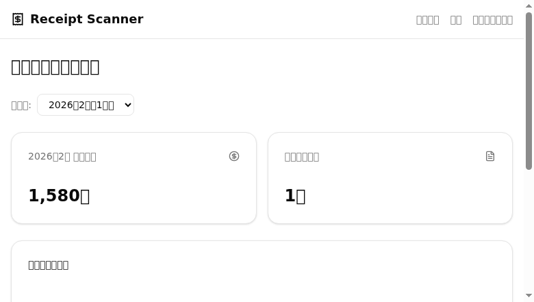
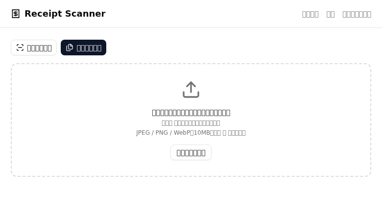
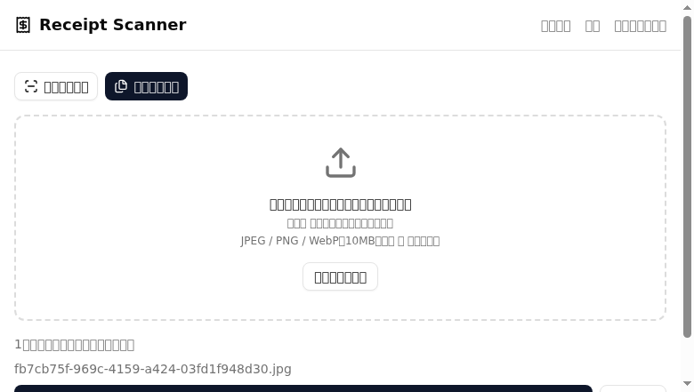
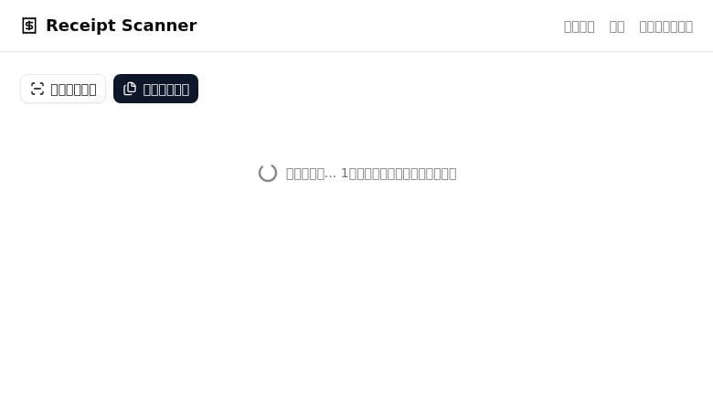
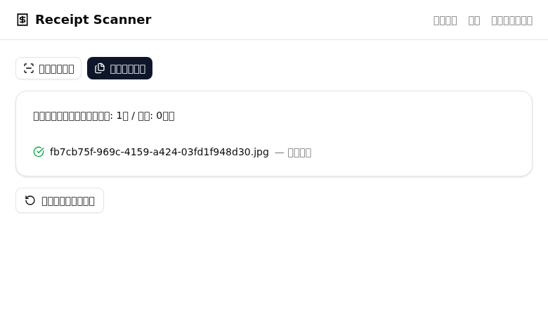
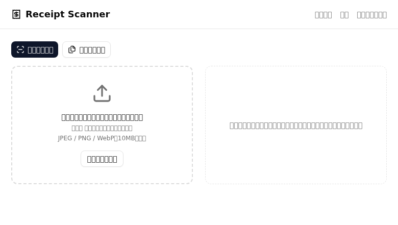
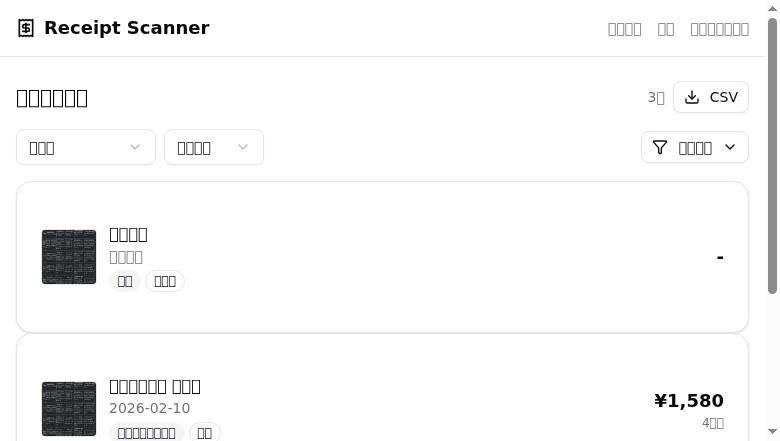

# Receipt Scanner Phase 3 検証レポート

## 実施日時
2026-02-14

## 環境
- OS: Linux (WSL2)
- ブラウザ: Chrome
- Backend: FastAPI (localhost:8000)
- Frontend: Vite + React (localhost:5173)

## テスト結果サマリ

| # | テスト名 | 結果 | 備考 |
|---|---|---|---|
| 1 | ダッシュボードページ表示 | ✅ | 月次サマリー・円グラフ正常表示 |
| 2 | 一括スキャンモード切替 | ✅ | 単一/一括モード切替・「複数選択可」表示 |
| 3 | 一括スキャン ファイル選択 | ✅ | ファイル選択・件数表示 |
| 4 | 一括スキャン 処理実行 | ✅ | アップロード→解析→結果表示 |
| 5 | 一括スキャン 結果表示 | ✅ | 成功/失敗件数・ファイル名・店名表示 |
| 6 | 単一モード復帰 | ✅ | 一括→単一モード切替正常 |
| 7 | 履歴ページ反映確認 | ✅ | 一括スキャン結果が履歴一覧に反映 |
| 8 | Backend テスト全件通過 | ✅ | 27 tests passed |
| 9 | Frontend ビルド成功 | ✅ | vite build エラーなし |

## 各テスト詳細

### テスト1: ダッシュボードページ表示
- 結果: ✅
- スクリーンショット: 
- 確認事項:
  - [x] Header に「ダッシュボード」ナビリンク表示
  - [x] 「月次ダッシュボード」見出し表示
  - [x] 年月セレクター表示（2026年2月）
  - [x] 合計金額カード表示（1,580円）
  - [x] レシート件数カード表示（1件）
  - [x] カテゴリ別内訳 円グラフ表示（食費 100%）

### テスト2: 一括スキャンモード切替
- 結果: ✅
- スクリーンショット: 
- 確認事項:
  - [x] 「単一スキャン」「一括スキャン」ボタン表示
  - [x] 一括モードで「複数選択可」テキスト表示
  - [x] ドラッグ＆ドロップ領域表示

### テスト3: 一括スキャン ファイル選択
- 結果: ✅
- スクリーンショット: 
- 確認事項:
  - [x] ファイル選択後「1件のファイルが選択されています」表示
  - [x] ファイル名一覧表示
  - [x] 「一括スキャン開始（1件）」ボタン表示
  - [x] 「クリア」ボタン表示

### テスト4: 一括スキャン 処理実行
- 結果: ✅
- スクリーンショット: 
- 確認事項:
  - [x] 「一括処理中...」ローディング表示

### テスト5: 一括スキャン 結果表示
- 結果: ✅
- スクリーンショット: 
- 確認事項:
  - [x] 「一括アップロード結果（成功: 1件 / 失敗: 0件）」表示
  - [x] 各ファイルの処理結果（ファイル名・店名）表示
  - [x] 「新しい一括スキャン」ボタン表示

### テスト6: 単一モード復帰
- 結果: ✅
- スクリーンショット: 
- 確認事項:
  - [x] 「複数選択可」テキスト非表示
  - [x] 通常のアップロードUI表示

### テスト7: 履歴ページ反映確認
- 結果: ✅
- スクリーンショット: 
- 確認事項:
  - [x] 一括スキャンで追加したレシートが一覧に表示
  - [x] レシート件数「3件」表示

### テスト8: Backend テスト全件通過
- 結果: ✅
- 27 tests passed (pytest -v)
- 内訳:
  - test_category_service: 6 tests
  - test_export_service: 2 tests
  - test_batch_scan: 2 tests
  - test_error_handlers: 4 tests
  - test_receipts_filter: 6 tests
  - test_summary_service: 7 tests

### テスト9: Frontend ビルド成功
- 結果: ✅
- `vite build` エラーなし完了

## 不具合一覧

| # | 内容 | 重要度 | 対応状況 |
|---|---|---|---|
| - | なし | - | - |

## 総合判定
✅ 全テスト合格 — Phase 3 機能（月次サマリーダッシュボード・複数画像一括アップロード・カテゴリ自動分類強化）全て正常動作確認済
